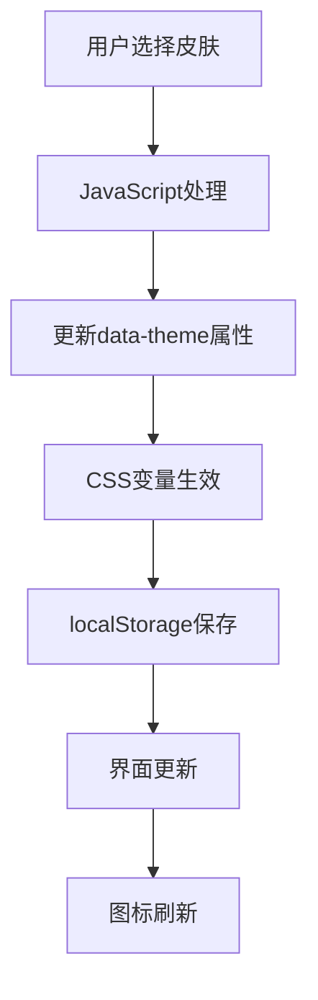
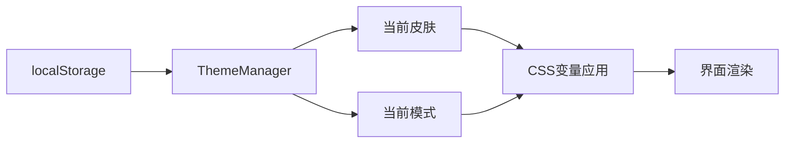
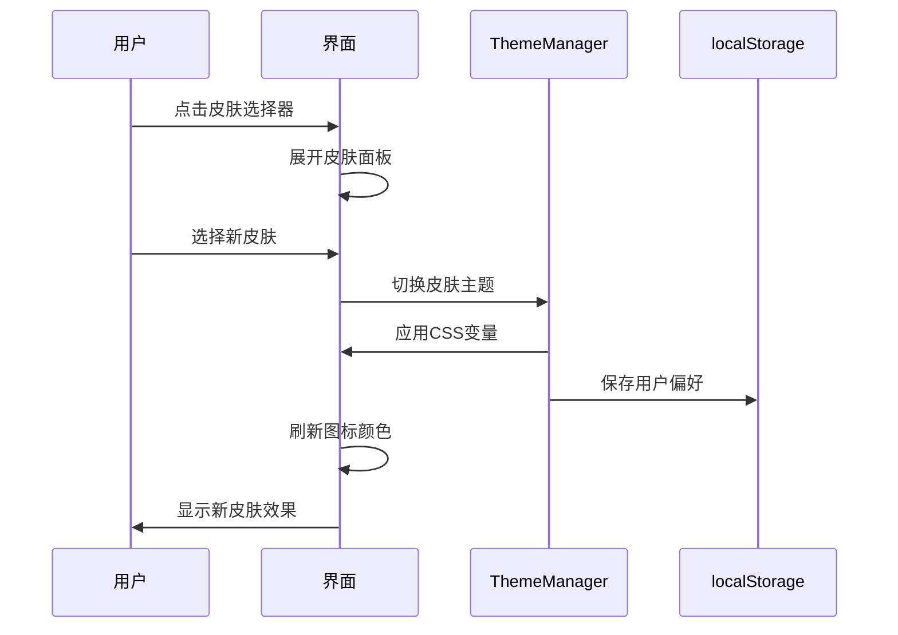

# 用户皮肤切换功能设计文档

## 概述

本文档设计了一个用户皮肤切换功能，允许用户在多个预设主题中切换，包括当前的亮色/暗黑模式以及新增的多种颜色主题皮肤。功能将基于现有的主题切换架构进行扩展，提供更丰富的个性化体验。

## 技术栈

- **前端框架**: 原生JavaScript ES6+
- **样式方案**: CSS3 变量 + CSS Grid/Flexbox
- **数据持久化**: localStorage
- **图标库**: Bootstrap Icons 1.11.1
- **字体**: Inter 字体族
- **兼容性**: 现代浏览器支持

## 架构设计

### 皮肤主题架构

采用基于CSS变量的主题系统，每个皮肤定义一套完整的颜色变量：



### 皮肤主题列表

系统将提供以下6种预设皮肤主题：

1. **霓虹风格** (默认)
   - 亮色模式: 白色背景 + 霓虹粉色强调
   - 暗黑模式: 深紫色渐变背景 + 霓虹发光效果

2. **海洋蓝调**
   - 亮色模式: 浅蓝色背景 + 深蓝色强调
   - 暗黑模式: 深海蓝背景 + 青色发光效果

3. **森林绿意**
   - 亮色模式: 淡绿色背景 + 深绿色强调
   - 暗黑模式: 深绿色背景 + 翡翠绿发光效果

4. **日落橙黄**
   - 亮色模式: 暖橙色背景 + 深橙色强调
   - 暗黑模式: 深橙色渐变背景 + 金黄色发光效果

5. **优雅紫色**
   - 亮色模式: 淡紫色背景 + 深紫色强调
   - 暗黑模式: 深紫色背景 + 紫色发光效果

6. **经典灰调**
   - 亮色模式: 纯白背景 + 经典灰色强调
   - 暗黑模式: 炭黑背景 + 银灰色强调

### 数据结构设计

皮肤配置对象：

```javascript
const SKIN_THEMES = {
  neon: {
    name: '霓虹风格',
    icon: 'bi-stars',
    colors: {
      light: { /* 亮色变量 */ },
      dark: { /* 暗黑变量 */ }
    }
  },
  ocean: {
    name: '海洋蓝调',
    icon: 'bi-water',
    colors: { /* ... */ }
  }
  // ... 其他主题
}
```

### 状态管理架构



## 用户界面设计

### 皮肤选择界面

在侧边栏原有主题切换区域扩展为皮肤选择面板：

1. **皮肤选择器**
   - 网格布局展示皮肤缩略图
   - 每个皮肤显示名称和预览色彩
   - 当前选中皮肤高亮显示

2. **模式切换器**
   - 保留原有的亮色/暗黑切换按钮
   - 应用于当前选中的皮肤主题

3. **展开/收起控制**
   - 默认状态只显示当前皮肤和模式切换
   - 点击可展开显示所有皮肤选项

### 交互流程



## 技术实现方案

### CSS变量系统扩展

基于现有的CSS变量架构，为每个皮肤定义完整的变量集：

```css
/* 霓虹风格 - 保持现有实现 */
:root {
  /* 现有变量保持不变 */
}

[data-theme="dark"] {
  /* 现有暗黑模式变量保持不变 */
}

/* 海洋蓝调皮肤 */
[data-skin="ocean"] {
  --primary-color: #0077BE;
  --secondary-color: #0096C7;
  --accent-color: #00B4D8;
  --neon-primary: #00F5FF;
  --neon-secondary: #40E0D0;
  /* ... 更多变量 */
}

[data-skin="ocean"][data-theme="dark"] {
  --bg-color: linear-gradient(135deg, #001122, #002244, #003366);
  --sidebar-bg: rgba(0, 34, 68, 0.8);
  /* ... 暗黑模式变量 */
}
```

### JavaScript主题管理器

扩展现有的主题管理功能：

```javascript
class ThemeManager {
  constructor() {
    this.currentSkin = 'neon';
    this.currentMode = 'light';
    this.init();
  }

  init() {
    this.loadUserPreferences();
    this.applyTheme();
    this.bindEvents();
  }

  setSkin(skinName) {
    this.currentSkin = skinName;
    this.applyTheme();
    this.savePreferences();
    this.refreshIcons();
  }

  toggleMode() {
    this.currentMode = this.currentMode === 'dark' ? 'light' : 'dark';
    this.applyTheme();
    this.savePreferences();
    this.refreshIcons();
  }

  applyTheme() {
    document.documentElement.setAttribute('data-skin', this.currentSkin);
    document.documentElement.setAttribute('data-theme', this.currentMode);
  }
}
```

### 组件设计

#### 皮肤选择器组件

```html
<div class="skin-selector">
  <div class="current-skin">
    <div class="skin-preview"></div>
    <span class="skin-name">霓虹风格</span>
    <button class="expand-btn">
      <i class="bi bi-chevron-down"></i>
    </button>
  </div>
  
  <div class="skin-options">
    <div class="skin-grid">
      <!-- 动态生成皮肤选项 -->
    </div>
  </div>
  
  <div class="mode-toggle">
    <button class="mode-btn">
      <i class="bi bi-moon"></i>
      <span>暗黑模式</span>
    </button>
  </div>
</div>
```

#### 皮肤预览组件

每个皮肤选项显示小型预览：

```html
<div class="skin-option" data-skin="ocean">
  <div class="skin-colors">
    <div class="color-dot primary"></div>
    <div class="color-dot secondary"></div>
    <div class="color-dot accent"></div>
  </div>
  <span class="skin-label">海洋蓝调</span>
</div>
```

### 响应式适配

#### 桌面端布局
- 皮肤选择器集成在侧边栏底部
- 展开时显示6个皮肤选项的2x3网格
- 模式切换按钮独立显示

#### 移动端布局
- 皮肤选择器添加到汉堡菜单中
- 展开时显示3x2网格适配小屏幕
- 支持触摸滑动选择皮肤

### 动画效果设计

#### 皮肤切换动画
```css
.theme-transition {
  transition: all 0.6s cubic-bezier(0.4, 0, 0.2, 1);
}

.skin-switching {
  animation: skinFade 0.6s ease-in-out;
}

@keyframes skinFade {
  0% { opacity: 1; }
  50% { opacity: 0.7; }
  100% { opacity: 1; }
}
```

#### 皮肤选择器动画
```css
.skin-options {
  max-height: 0;
  overflow: hidden;
  transition: max-height 0.3s ease;
}

.skin-selector.expanded .skin-options {
  max-height: 200px;
}

.skin-option {
  transform: translateY(10px);
  opacity: 0;
  animation: slideInUp 0.3s ease forwards;
}
```

## 兼容性处理

### 浏览器兼容性
- 现代浏览器：完整功能支持
- 老版本浏览器：降级到基础亮/暗模式
- CSS变量不支持时的fallback处理

### 设备适配
- 触摸设备：优化触摸区域和手势
- 小屏设备：简化皮肤选择界面
- 高分辨率屏幕：矢量图标和清晰渲染

### 性能优化

#### CSS性能
- 使用CSS变量避免大量重复样式
- 预定义关键帧动画避免运行时计算
- 使用transform和opacity属性进行硬件加速

#### JavaScript性能
- 皮肤配置懒加载
- 防抖动处理快速切换
- 图标刷新批量处理

#### 缓存策略
- localStorage缓存用户偏好
- CSS变量值缓存避免重复计算
- 图标生成结果缓存

## 测试策略

### 功能测试
- 皮肤切换正确性验证
- 模式切换在所有皮肤下的表现
- 用户偏好持久化测试
- 页面刷新后状态保持测试

### 兼容性测试
- 主流浏览器兼容性
- 移动端设备适配
- 不同屏幕尺寸下的显示效果

### 性能测试
- 皮肤切换响应时间
- 内存使用情况监控
- CSS变量切换性能分析

### 用户体验测试
- 皮肤选择流程易用性
- 视觉反馈清晰度
- 无障碍访问支持


## 用户界面设计

### 皮肤选择界面

在侧边栏原有主题切换区域扩展为皮肤选择面板：

1. **皮肤选择器**
   - 网格布局展示皮肤缩略图
   - 每个皮肤显示名称和预览色彩
   - 当前选中皮肤高亮显示

2. **模式切换器**
   - 保留原有的亮色/暗黑切换按钮
   - 应用于当前选中的皮肤主题

3. **展开/收起控制**
   - 默认状态只显示当前皮肤和模式切换
   - 点击可展开显示所有皮肤选项

### 交互流程


## 技术实现方案

### CSS变量系统扩展

基于现有的CSS变量架构，为每个皮肤定义完整的变量集：

```css
/* 霓虹风格 - 保持现有实现 */
:root {
  /* 现有变量保持不变 */
}

[data-theme="dark"] {
  /* 现有暗黑模式变量保持不变 */
}

/* 海洋蓝调皮肤 */
[data-skin="ocean"] {
  --primary-color: #0077BE;
  --secondary-color: #0096C7;
  --accent-color: #00B4D8;
  --neon-primary: #00F5FF;
  --neon-secondary: #40E0D0;
  /* ... 更多变量 */
}

[data-skin="ocean"][data-theme="dark"] {
  --bg-color: linear-gradient(135deg, #001122, #002244, #003366);
  --sidebar-bg: rgba(0, 34, 68, 0.8);
  /* ... 暗黑模式变量 */
}
```

### JavaScript主题管理器

扩展现有的主题管理功能：

```javascript
class ThemeManager {
  constructor() {
    this.currentSkin = 'neon';
    this.currentMode = 'light';
    this.init();
  }

  init() {
    this.loadUserPreferences();
    this.applyTheme();
    this.bindEvents();
  }

  setSkin(skinName) {
    this.currentSkin = skinName;
    this.applyTheme();
    this.savePreferences();
    this.refreshIcons();
  }

  toggleMode() {
    this.currentMode = this.currentMode === 'dark' ? 'light' : 'dark';
    this.applyTheme();
    this.savePreferences();
    this.refreshIcons();
  }

  applyTheme() {
    document.documentElement.setAttribute('data-skin', this.currentSkin);
    document.documentElement.setAttribute('data-theme', this.currentMode);
  }
}
```

### 组件设计

#### 皮肤选择器组件

```html
<div class="skin-selector">
  <div class="current-skin">
    <div class="skin-preview"></div>
    <span class="skin-name">霓虹风格</span>
    <button class="expand-btn">
      <i class="bi bi-chevron-down"></i>
    </button>
  </div>
  
  <div class="skin-options">
    <div class="skin-grid">
      <!-- 动态生成皮肤选项 -->
    </div>
  </div>
  
  <div class="mode-toggle">
    <button class="mode-btn">
      <i class="bi bi-moon"></i>
      <span>暗黑模式</span>
    </button>
  </div>
</div>
```

#### 皮肤预览组件

每个皮肤选项显示小型预览：

```html
<div class="skin-option" data-skin="ocean">
  <div class="skin-colors">
    <div class="color-dot primary"></div>
    <div class="color-dot secondary"></div>
    <div class="color-dot accent"></div>
  </div>
  <span class="skin-label">海洋蓝调</span>
</div>
```

### 响应式适配

#### 桌面端布局
- 皮肤选择器集成在侧边栏底部
- 展开时显示6个皮肤选项的2x3网格
- 模式切换按钮独立显示

#### 移动端布局
- 皮肤选择器添加到汉堡菜单中
- 展开时显示3x2网格适配小屏幕
- 支持触摸滑动选择皮肤

### 动画效果设计

#### 皮肤切换动画
```css
.theme-transition {
  transition: all 0.6s cubic-bezier(0.4, 0, 0.2, 1);
}

.skin-switching {
  animation: skinFade 0.6s ease-in-out;
}

@keyframes skinFade {
  0% { opacity: 1; }
  50% { opacity: 0.7; }
  100% { opacity: 1; }
}
```

#### 皮肤选择器动画
```css
.skin-options {
  max-height: 0;
  overflow: hidden;
  transition: max-height 0.3s ease;
}

.skin-selector.expanded .skin-options {
  max-height: 200px;
}

.skin-option {
  transform: translateY(10px);
  opacity: 0;
  animation: slideInUp 0.3s ease forwards;
}
```

## 兼容性处理

### 浏览器兼容性
- 现代浏览器：完整功能支持
- 老版本浏览器：降级到基础亮/暗模式
- CSS变量不支持时的fallback处理

### 设备适配
- 触摸设备：优化触摸区域和手势
- 小屏设备：简化皮肤选择界面
- 高分辨率屏幕：矢量图标和清晰渲染

### 性能优化

#### CSS性能
- 使用CSS变量避免大量重复样式
- 预定义关键帧动画避免运行时计算
- 使用transform和opacity属性进行硬件加速

#### JavaScript性能
- 皮肤配置懒加载
- 防抖动处理快速切换
- 图标刷新批量处理

#### 缓存策略
- localStorage缓存用户偏好
- CSS变量值缓存避免重复计算
- 图标生成结果缓存

## 测试策略

### 功能测试
- 皮肤切换正确性验证
- 模式切换在所有皮肤下的表现
- 用户偏好持久化测试
- 页面刷新后状态保持测试

### 兼容性测试
- 主流浏览器兼容性
- 移动端设备适配
- 不同屏幕尺寸下的显示效果

### 性能测试
- 皮肤切换响应时间
- 内存使用情况监控
- CSS变量切换性能分析

### 用户体验测试
- 皮肤选择流程易用性
- 视觉反馈清晰度
- 无障碍访问支持


