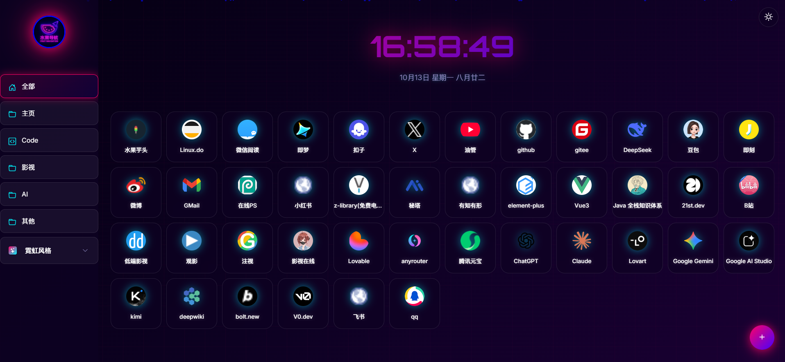
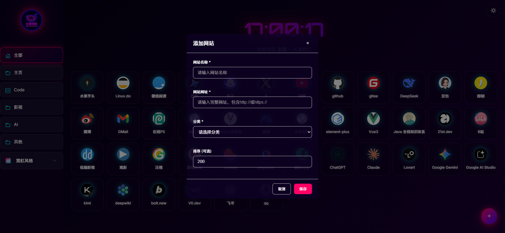
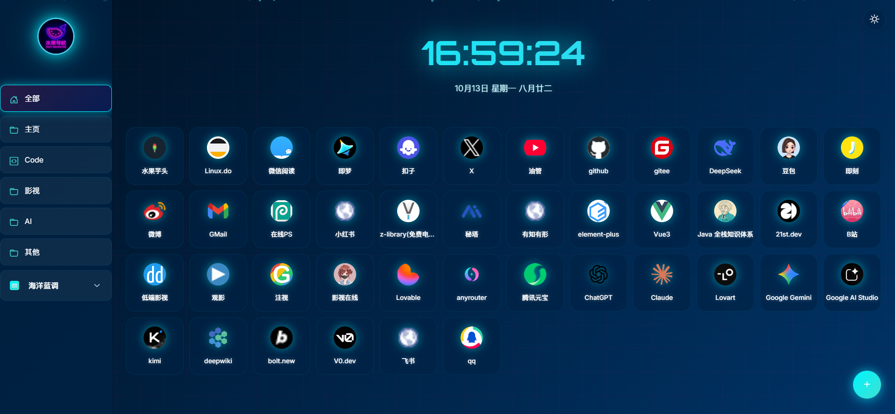
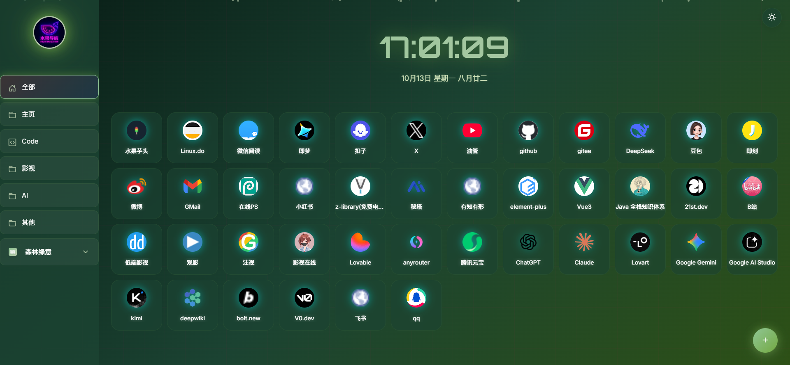
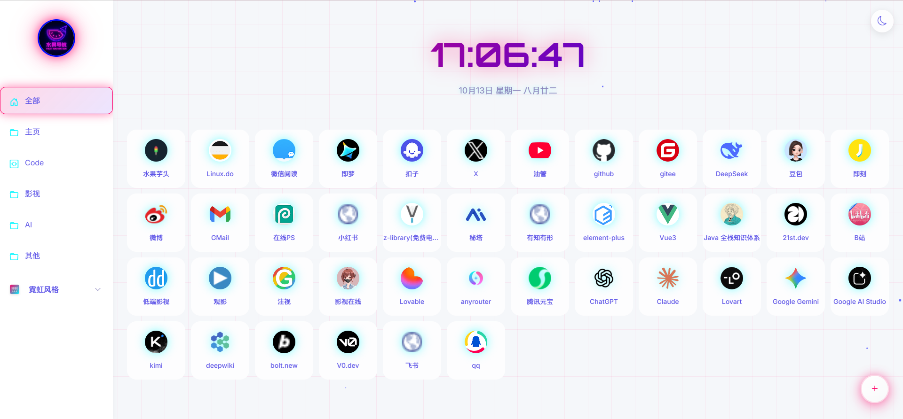
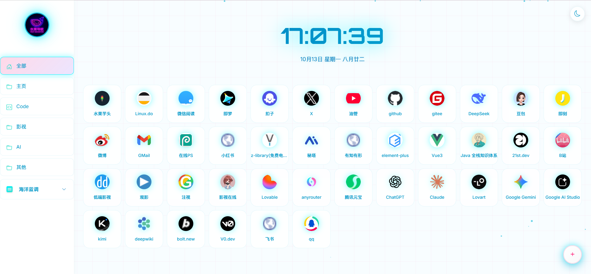
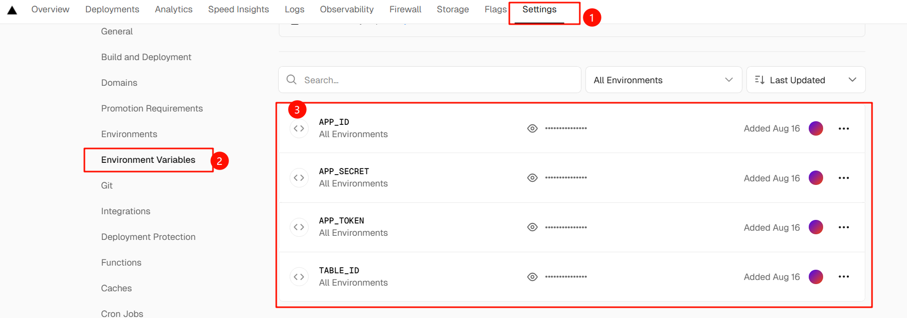

# 🌐 导航网站项目

## 📖 项目介绍

这是一个基于飞书多维表格开发的导航网站。 **在线演示地址**：[https://navsite-phi.vercel.app/](https://navsite-phi.vercel.app/)

<table>
  <tr>
    <td></td>
    <td></td>
  </tr>
  <tr>
    <td></td>
    <td></td>
  </tr>
   <tr>
    <td></td>
    <td></td>
  </tr>
</table>

### 🌟 项目亮点
- **📱 PWA 应用**：支持离线访问和桌面安装，提供原生应用体验
- **🌙 多种皮肤主题**：自动跟随系统偏好的暗黑模式，支持手动切换，多个皮肤主题随意切换
- **⚡ 高性能**：智能缓存机制，快速响应，优秀的用户体验
- **🔧 易部署**：一键部署到Vercel，后续支持多种部署方式

## 🛠️ 技术栈

### ⚙️ 后端技术

- **Node.js + Express**：服务器框架
- **axios**：HTTP客户端，用于调用飞书API
- **dotenv**：环境变量管理

### 🎨 前端技术

- **原生JavaScript**：无框架依赖，轻量高效
- **CSS3**：现代CSS特性，支持CSS变量和动画
- **Bootstrap Icons**：图标库
- **响应式设计**：移动端优先的设计理念

### 🔗 API集成

- **飞书开放平台API**：多维表格数据获取
- **Google Favicon API**：自动获取网站图标

### 🌐 部署支持
- **Vercel**：已配置vercel.json，支持一键部署 使用Vercel一键部署 
[](https://vercel.com/new/clone?repository-url=https://github.com/wubh2012/navsite)
- **PWA 支持**：满足 Progressive Web App 标准，支持离线访问和桌面安装


## 📁 项目结构

```
├── public/                          # 静态资源目录
│   ├── css/
│   │   └── style.css               # 主样式文件
│   ├── js/
│   │   └── app.js                  # 前端主逻辑
│   ├── img/
│   │   ├── avatar.svg              # 用户头像图标
│   │   ├── favicon.ico             # 网站图标
│   │   ├── icons/                  # PWA 图标资源目录
│   │   │   ├── icon-72x72.png      # 多尺寸 PWA 图标
│   │   │   ├── icon-192x192.png
│   │   │   └── ...
│   │   └── screenshots/            # PWA 截图目录
│   ├── manifest.json               # PWA Manifest 文件
│   ├── sw.js                       # Service Worker 脚本
│   ├── browserconfig.xml           # Microsoft 平台配置
│   └── index.html                  # 主页面，响应式布局，包含PWA支持
├── doc/                            # 文档目录
├── specs/                          # 规格说明
├── .env                            # 环境变量配置（不应提交到版本控制）
├── .env.example                    # 环境变量示例
├── .gitignore                      # Git忽略文件配置
├── package.json                    # 项目依赖配置
├── server.js                       # 服务器入口文件，包含飞书API集成
├── vercel.json                     # Vercel部署配置
└── README.md                       # 项目说明文档
```

## 📝 完整配置指南

### 📋 前置条件详细说明

**必需条件：**
- Node.js 14.0+ （[下载地址](https://nodejs.org/)）
- 飞书账号（免费注册：[飞书官网](https://www.feishu.cn/)）

**可选条件：**
- Git（用于克隆项目）
- 代码编辑器（如VS Code、Trae、Claude Code）

### 🔧 步骤1：创建飞书应用

> ⚠️ **配置提醒**：飞书应用的配置需要仔细核对，建议按照图文教程逐步操作。

📖 [查看详细图文教程 →](./doc/创建飞书应用.md)


### 📊 步骤2：创建多维表格

完成飞书应用创建后，接下来配置数据存储的多维表格。

📖 [查看配置指南 →](./doc/飞书多维表格设置.md)


### 💻 步骤3: 本地启动开发

1. **克隆或下载项目代码**

   ```bash
   git clone https://github.com/wubh2012/navsite.git
   cd navsite
   ```
   
2. **安装依赖**

   ```bash
   npm install
   ```
   
3. **🔐 配置环境变量**

   - 复制`.env.example` 为`.env`
     ```bash
     copy .env.example .env  # Windows
     # 或 cp .env.example .env  # Linux/Mac
     ```
   - 使用文本编辑器打开`.env`文件，填入你的飞书应用信息：
     ```env
     # 飞书应用凭证
     APP_ID=你的飞书应用ID
     APP_SECRET=你的飞书应用密钥
     
     # 飞书多维表格信息  
     APP_TOKEN=你的多维表格Token
     TABLE_ID=你的表格ID
     
     # 服务器端口
     PORT=3000
     ```
   
   > ⚠️ **安全提示**：
   > - `.env`文件包含敏感信息，切勿提交到版本控制系统
   > - 生产环境请使用平台的环境变量配置功能
   > - 定期更换APP_SECRET以确保安全

4. **启动项目**

   ```bash
   npm run dev
   ```
   
5. **打开浏览器，访问** `http://localhost:3000`

## 📦 部署到生产环境

### 🚀 Vercel 部署（推荐，免费）

1. **准备工作**
   ```bash
   # 将代码推送到GitHub
   git add .
   git commit -m "Initial commit"
   git push origin main
   ```

2. **Vercel部署步骤**
   - 访问 [Vercel官网](https://vercel.com)
   - 使用GitHub账号登录
   - 点击"New Project"导入GitHub仓库
   - 在"Environment Variables"中配置环境变量：
     ```
     APP_ID=你的飞书应用ID
     APP_SECRET=你的飞书应用密钥
     APP_TOKEN=你的多维表格Token
     TABLE_ID=你的表格ID
     ```
     
   - 点击"Deploy"开始部署

3. **部署完成**
   - 部署成功后会获得一个`.vercel.app`域名
   - 可以绑定自定义域名

### 🔄 其他部署选项

**🔗 Netlify部署**： TODO


## 🔧 常见问题解决

### ❗ 数据获取失败

**症状**：页面显示“获取数据失败”或空白

**解决步骤**：

1. **检查控制台错误**
   ```bash
   # 打开浏览器开发者工具（F12）
   # 查看Console标签页的错误信息
   ```

2. **验证环境变量**
   ```bash
   # 检查.env文件是否存在且格式正确
   type .env  # Windows
   # 或 cat .env  # Linux/Mac
   
   # 重启服务器
   npm run dev
   ```

3. **测试API连接**
   ```bash
   # 访问API接口测试
   # 在浏览器中访问：http://localhost:3000/api/navigation
   ```

**常见错误码及解决方案**：
- `400 Bad Request`：检查APP_TOKEN和TABLE_ID是否正确
- `401 Unauthorized`：检查APP_ID和APP_SECRET是否正确
- `403 Forbidden`：检查飞书应用权限是否配置正确
- `404 Not Found`：检查TABLE_ID是否存在
- `500 Internal Server Error`：检查服务器控制台错误日志

### ❗ 权限配置问题

**症状**：API返回权限不足错误

**解决方案**：
1. 重新检查飞书应用权限配置
2. 确保应用已发布（状态为“已启用”）
3. 等待权限生效（通常需要1-2分钟）

### ❗ 暗黑模式不生效

**解决方案**：
```javascript
// 清除浏览器缓存和本地存储
localStorage.clear();
// 然后刷新页面
```

### ❗ 移动端显示异常

**解决方案**：
1. 清除浏览器缓存
2. 检查手机浏览器是否为最新版本
3. 尝试使用其他浏览器

## 📞 获取帮助

遇到问题时的求助渠道：

1. **查看文档**：先查看本README和`doc/`目录下的详细文档
2. **问题反馈**：[GitHub Issues](https://github.com/wubh2012/navsite/issues)
3. **功能建议**：通过Issues提交功能需求
4. **紧急问题**：可以通过邮件联系维护者

**提交问题时请提供**：
- 💻 操作系统和浏览器版本
- 📷 错误截图或控制台错误信息
- 🔄 复现步骤
- ✅ 期望的结果
- 🔗 相关的配置信息（去掉敏感数据）

## 📅 更新日志

### v1.2.0 (当前版本)

- ✅ **PWA 支持**：完整的 Progressive Web App 功能
  - 离线访问支持，断网状态下仍可使用
  - 桌面安装支持，可安装为原生应用
  - 智能缓存策略，提升加载速度
  - 自动更新机制，新版本发布时智能提示
  - 跨平台支持（Android、iOS、Windows、macOS）
- ✅ **Service Worker**：实现后台缓存和离线功能
- ✅ **Web App Manifest**：完整的应用元信息配置
- ✅ **多尺寸图标**：支持不同设备的图标需求

### v1.0.0

- ✅ 基础导航功能
- ✅ 飞书多维表格集成
- ✅ 响应式设计
- ✅ 暗黑模式支持
- ✅ 移动端搜索功能
- ✅ 触摸手势支持
- ✅ 农历日期显示
- ✅ 数据缓存机制
- ✅ Vercel部署支持
- ✅ 霓虹主题风格
- ✅ 更多主题选项（霓虹主题变体）

### 🔮 计划功能

- 多语言支持（中英文切换）
- 随机切换背景图片
- 拖拽排序功能


## 🤝 贡献指南

欢迎提交Issue和Pull Request来改进这个项目！

### 🔄 开发流程

1. Fork 项目
2. 创建功能分支 (`git checkout -b feature/AmazingFeature`)
3. 提交更改 (`git commit -m 'Add some AmazingFeature'`)
4. 推送到分支 (`git push origin feature/AmazingFeature`)
5. 创建 Pull Request

### 📝 代码规范

- ✨ 使用2空格缩进
- 🎨 遵循现有的代码风格
- 📝 添加必要的注释
- 📱 确保移动端兼容性
- ✅ 添加单元测试（如适用）
- 🔒 遵循安全最佳实践

## 📄 许可证

MIT License - 详见 [LICENSE](LICENSE) 文件