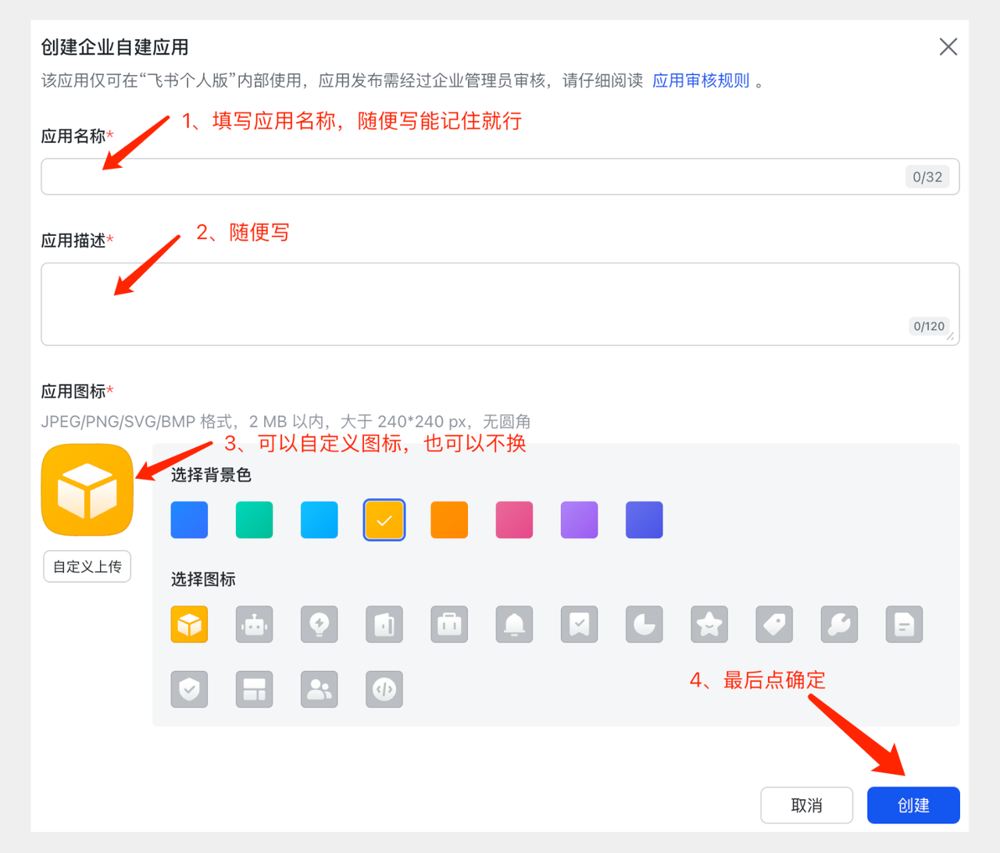

1. **访问飞书开发者平台**
   - 登录 [飞书开发者平台](https://open.feishu.cn/app/)
   - 点击“创建自建应用”
   

2. **配置应用基本信息**
   ```
   应用名称：导航网站
   应用描述：用于读取多维表格数据的导航网站
   ```
   

3. **添加权限范围**（❗ 关键步骤）
   - 进入“权限管理”页面
   - 搜索并添加以下权限：
     - `bitable:app` - 获取多维表格信息
     - `bitable:app:readonly` - 读取多维表格内容


4. **创建并发布应用版本**
  
  
   
5. **获取应用凭证**
   - 复制 App ID 和 App Secret
   - ⚠️ 请妥善保存，后续配置需要使用


