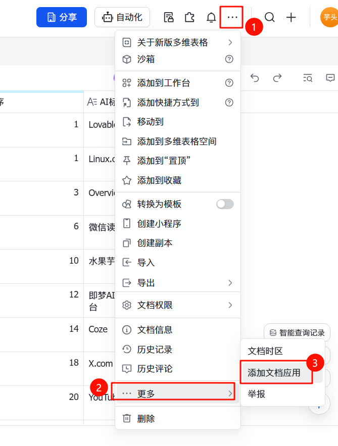

1. **创建表格**
   - 在飞书中进入云盘（注意：不能在知识库中创建）
   
   - 新建多维表格，表格名称建议：`导航网站数据`
    

2. **设置字段**（必须严格按照以下格式）
   | 字段名称 | 字段类型 | 是否必填 | 说明 |
   |---|---|---|---|
   | 站点名称 | 单行文本 | 是 | 显示的网站名称 |
   | 网址 | 链接 | 是 | 网站链接地址 |
   | 分类 | 单选 | 是 | 网站分类（如：工具、设计） |
   | 排序 | 数字 | 否 | 显示顺序，数字越小越靠前 |

   

3. **添加示例数据**
   ```
   站点名称: Google    网址: https://google.com    分类: 搜索    排序: 1
   站点名称: GitHub    网址: https://github.com    分类: 开发    排序: 2
   ```

4. **获取表格信息**
   - 复制多维表格的链接，从中提取 `app_token` 和 `table_id`
   - 链接格式：`https://xxx.feishu.cn/base/APP_TOKEN?table=TABLE_ID`
   

5. 给多维表格添加应用
   - 进入飞书多维表格设置页面
   - 点击“添加应用”
   - 选择“自定义应用”
   - 输入应用名称，比如：`导航网站`
   
   
   

