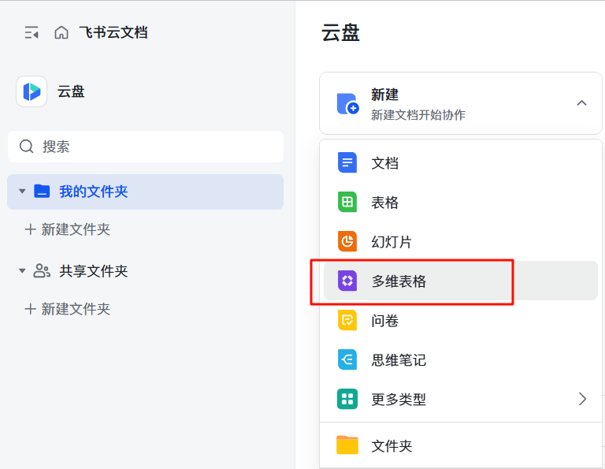
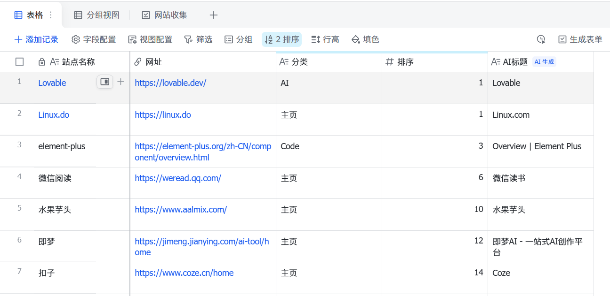
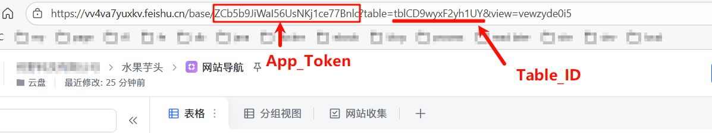

1. 进入云盘, 创建多维表格，注意：不能在知识库中创建，否则应用无法读取。

2. 新建一个多维表格

多维表格的名称可以随便取，比如： 网站导航。

多维表格中的字段包含以下列
  - 站点名称：文本类型
  - 网址: 链接
  - 分类: 文本
  - 排序: 数字

3. 获取飞书多维表格 Token 和 TableID
> 在多维表格的设置中获取 Token 和 TableID，部署的时候需要用到。

4. 飞书多维表格添加应用
